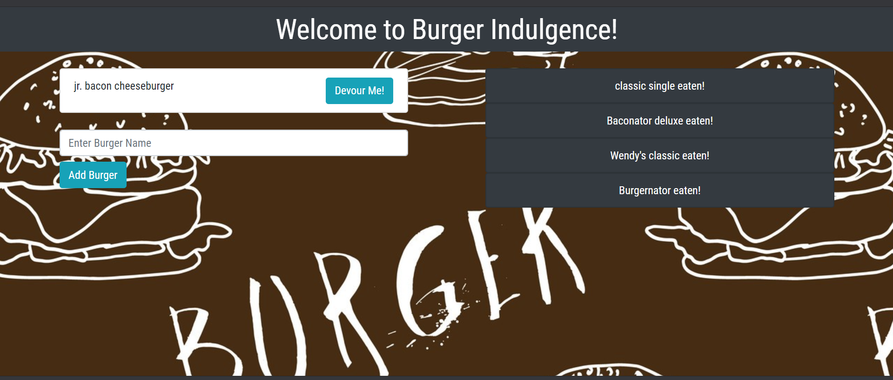

# burger

[Burger Indulgence!](https://guarded-sands-01783.herokuapp.com/) is a restaurant app that lets users input the names of burgers they'd like to eat.

# Technology
This app introduces the complete MVC model using a mySQL database along with Express and Express Handlebars.

# Use case
Whenever a user submits a burger's name, your app will display the burger on the left side of the page -- waiting to be devoured.

Each burger in the waiting area also has a Devour Me! button. When the user clicks it, the burger will move to the right side of the page as show as eaten/devoured.

Indulge!!

# see app here:
[https://guarded-sands-01783.herokuapp.com](https://guarded-sands-01783.herokuapp.com)

